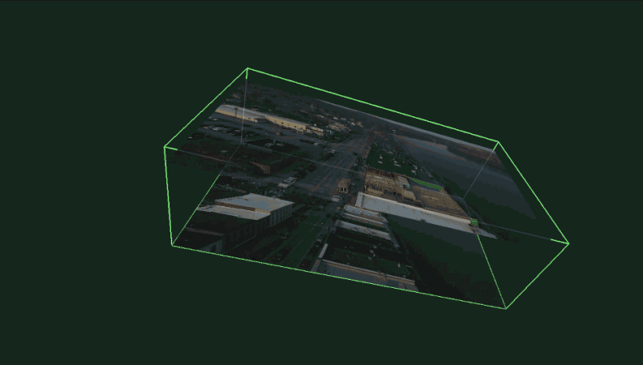
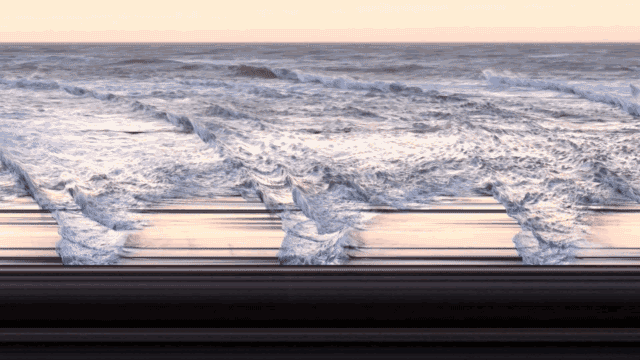

## Spacelapser

Spacelapser is a tool for exploring the three-dimensional volumes created by loading an entire video into memory. Depending on the motion of the camera, this volume can resemble a lightfield, a slit-scan camera, or a special relativity simulator.

### Installation

The project was built in OpenFrameworks and should be cross-platform. It is tested built with Xcode on OS X.
